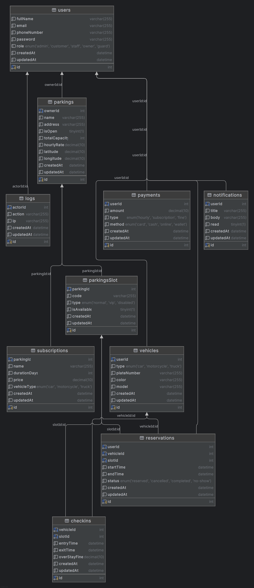
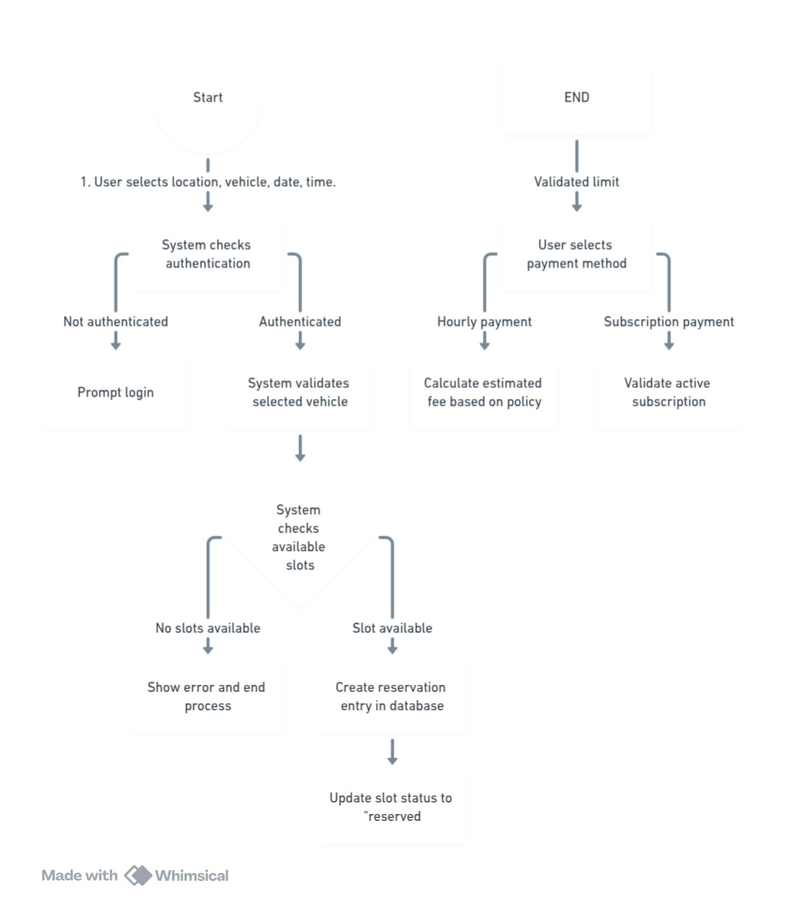
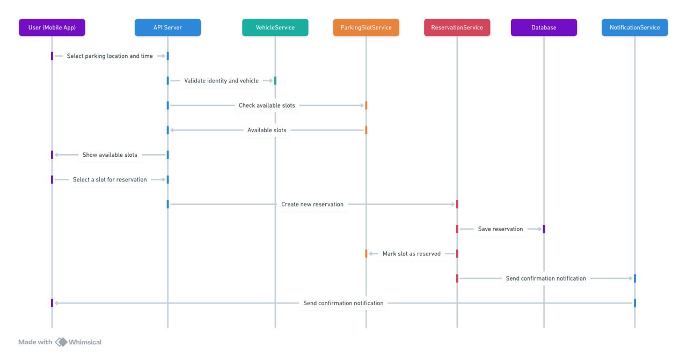

# 🚗 Parking Server API

Welcome to the **Parking Server API** project! This is a robust backend service designed to manage parking facilities, subscriptions, vehicles, users, payments, notifications, and more.

---

## 🌟 Features

| Feature               | Description                                                                                     |
| --------------------- | ----------------------------------------------------------------------------------------------- |
| 🔐 Authentication     | User registration, login, OTP verification, JWT-based authentication, role-based access control |
| 🅿️ Parking Management | Create, update, delete, and retrieve parking lots and parking slots                             |
| 📅 Reservations       | Manage parking reservations with CRUD operations                                                |
| 🚗 Vehicle Management | Manage vehicles associated with users                                                           |
| 💳 Payments           | Handle payment processing and records                                                           |
| 🔔 Notifications      | Send and manage notifications                                                                   |
| 📋 Logs               | Maintain logs for system activities                                                             |
| 📦 Subscriptions      | Manage subscription plans for parking                                                           |
| 🛡️ Security           | Helmet middleware for securing HTTP headers                                                     |
| 📊 API Documentation  | Swagger UI integration for API docs                                                             |

---

## 🛠️ Technologies Used

| Technology                                                                                 | Purpose                              |
| ------------------------------------------------------------------------------------------ | ------------------------------------ |
|        | Backend runtime environment          |
|        | Web framework for Node.js            |
|  | ORM for database management          |
|             | Data validation                      |
|    | JSON Web Token authentication        |
|        | API documentation                    |
|           | Security middleware for HTTP headers |
|         | HTTP request logger middleware       |
|           | Environment variable management      |
|           | Utility library                      |

---

## 📁 Project Structure

```
src/
├── config/                 # Configuration files
├── controllers/            # API controllers for business logic
├── models/                 # Sequelize models
├── routes/                 # Express route definitions
├── swagger.js              # Swagger configuration
├── index.js                # Application entry point
diagrams/                   # UML and ER diagrams
```

---

## 📖 API Documentation

The API is fully documented using Swagger. Access the interactive API docs at:

```
http://localhost:<PORT>/api-docs
```

---

## 📊 Diagrams

Visual diagrams to understand the system architecture and workflows are included in the `diagrams/` folder:

| Diagram Type        | File Name            | Description                       | Preview                                            |
| ------------------- | -------------------- | --------------------------------- | -------------------------------------------------- |
| Entity-Relationship | ERD_diagram.png      | Database schema and relationships |            |
| Activity Diagram    | activity_diagram.jpg | Workflow of key processes         |  |
| Sequence Diagram    | sequence_diagram.jpg | Interaction between components    |  |

---

## 🚀 Getting Started

1. Clone the repository
2. Run `npm install` to install dependencies
3. Configure environment variables in `.env`
4. Run the server with `npm start` or `node src/index.js`
5. Access API docs at `/api-docs`

---

## 🤝 Contributing

Contributions are welcome! Please open issues or submit pull requests for improvements.

---

## 📜 License

This project is licensed under the MIT License.

---

Thank you for using the Parking Server API! 🚗💨
